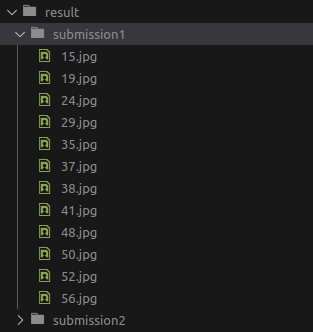
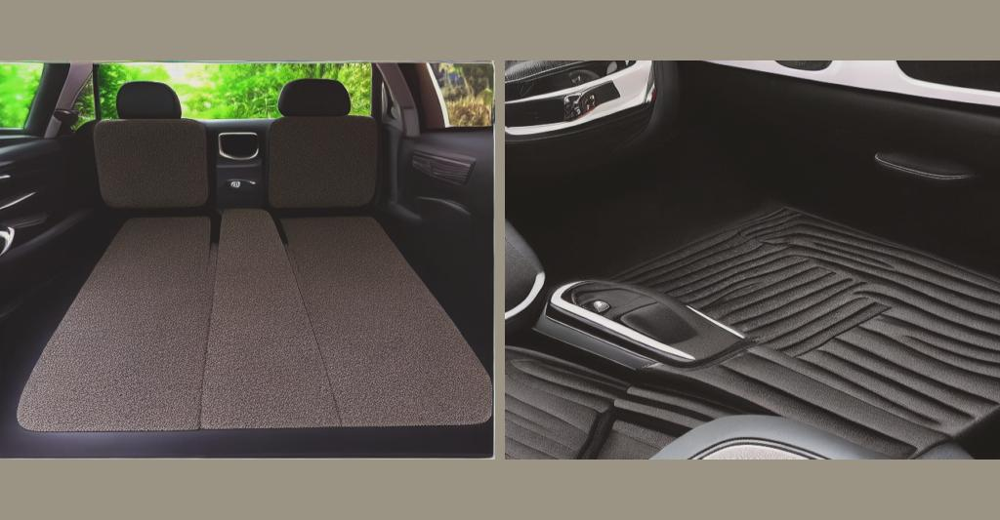
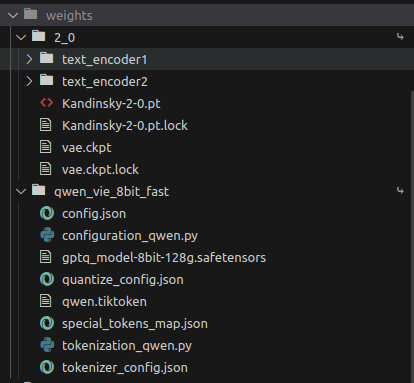

### Zalo AI Challenge 2023 - Advertising Banner Generation <br>T-sharp Team

We are pleased to announce our **1st-place ranking** on the public leaderboard (private leaderboard comming soon)


### The poster shown at Zalo AI summit 2023.


### Docker deployment
1. Docker build

    ```bash
    $ docker build -t zac2023:env_code_v15 .
    ```
2. Docker run

    ```bash
    $ export WEIGHT_PATH= path to pretrained models (folder structure described in Appendix)
    $ export INFO_PATH= path to info.csv
    $ export RESULT_PATH= path to result folder

    $ docker run --rm --gpus="device=2"  \
    -v $WEIGHT_PATH:/code/weights \
    -v $INFO_PATH:/data/private/info.csv \
    -v $RESULT_PATH:/results \
    zac2023:env_code_v15 \
    /bin/bash /code/predict.sh
    ```
3. Results

    After running the script, you can find the results in ```RESULT_PATH```
    

    Sample 91.jpg
    

### Appendix <a id="appendix"></a>
Pretrained models team used in this challenge are: [Kandinsky2.0](https://github.com/ai-forever/Kandinsky-2) and [Finetuned Qwen7B](https://huggingface.co/VillaLabs/Qwen-7b-chat-vietnamese).

To gain better speed in keywords extration, we quantized the model Qwen into 8bit using [AutoGPTQ](https://github.com/PanQiWei/AutoGPTQ)

After all, we placed models in folder `WEIGHT_PATH` as following structure
